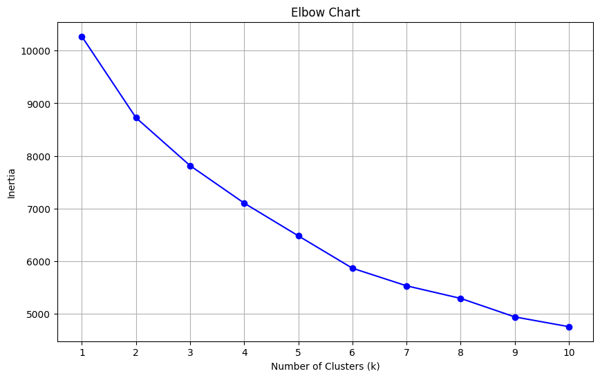
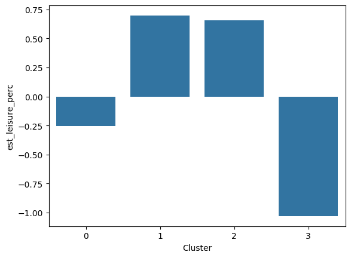
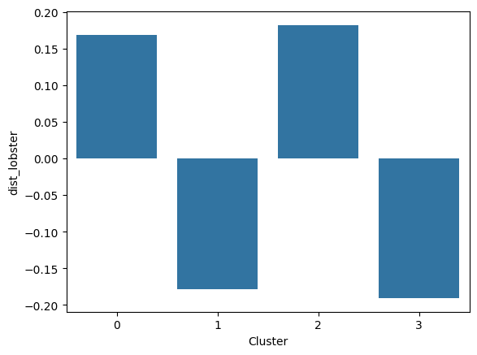
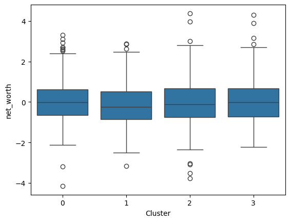
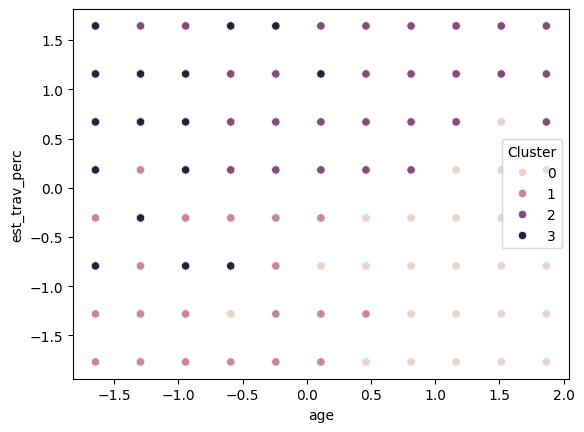

# Customer Segmentation for Lobster Land

This project focuses on clustering customers of a fictional theme park, **Lobster Land**, using KMeans clustering and statistical analysis to uncover key behavioral segments. The goal is to identify actionable customer insights that can drive personalized marketing and park experience strategies.

---

## Project Overview

Lobster Land wants to improve its targeting strategy by understanding how different customer groups behave based on:
- Estimated travel percentage
- Estimated leisure percentage
- Age
- Net worth
- Proximity to the park

Using unsupervised learning and statistical techniques, we uncovered 4 distinct clusters with unique behavioral patterns.

---

## Key Findings

- **Cluster 0 – Homebodies**: Young, low leisure/travel habits, and lower net worth.
- **Cluster 1 – Leisure Enthusiasts**: Young with high leisure preference and average travel habits.
- **Cluster 2 – Traveling Elite**: Wealthy, mid-aged individuals who prefer travel.
- **Cluster 3 – Local Leisure Lovers**: Older individuals living close to the park, with a strong preference for leisure.

### Boxplot Analysis
A boxplot of `est_leisure_perc` revealed:
- Cluster 1 has the **highest** leisure percentage.
- Cluster 0 shows the **lowest**.
- Clusters 2 and 3 fall around the average.

---

## Business Recommendations

- **Cluster 0**: Promote staycations and relaxation packages with food delivery options.
- **Cluster 1**: Enhance on-site relaxation-focused experiences.
- **Cluster 2**: Offer luxury travel-themed events and premium experiences.
- **Cluster 3**: Improve local access and offer resident discounts to drive frequent visits.

---

## Tech Stack

- **Python**: Data processing and modeling
- **Scikit-learn**: KMeans Clustering
- **Pandas & NumPy**: Data manipulation
- **Matplotlib & Seaborn**: Visualizations
